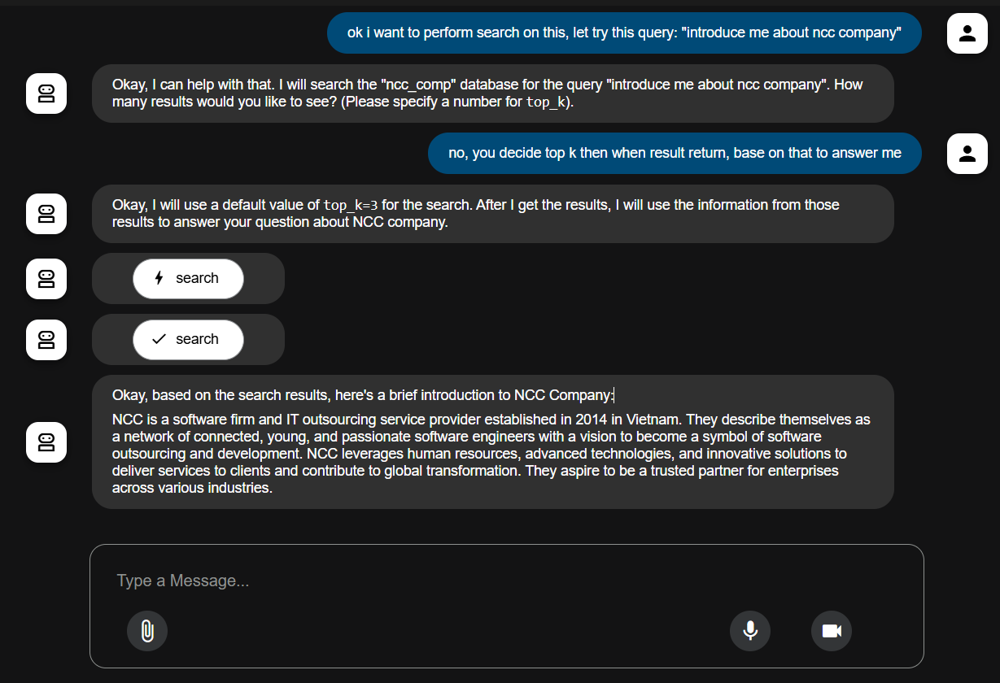
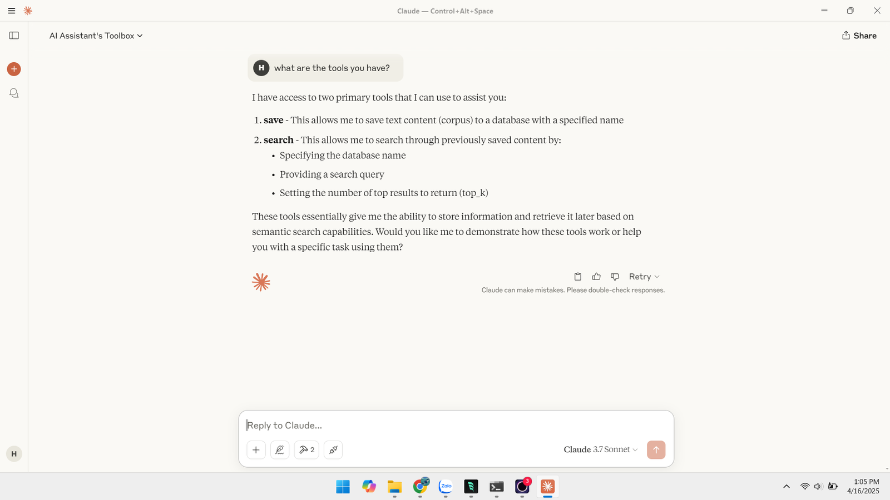

# MCP Server Demo

This repository demonstrates the use of the Model Context Protocol (MCP) through FastMCP, a Python framework designed to simplify the creation of MCP servers. It showcases how to expose tools and resources to Large Language Models (LLMs) like Claude, enabling seamless integration with local and remote data sources.

## What is MCP?

The Model Context Protocol (MCP) is an open standard that facilitates structured communication between AI models and external systems. It allows developers to expose:

- **Tools**: Functions that perform actions or computations.
- **Resources**: Data endpoints providing contextual information.
- **Prompts**: Templates guiding LLM interactions.

By using MCP, developers can create modular and reusable components that LLMs can interact with, enhancing the capabilities of AI applications.

## What is FastMCP?

FastMCP is a Python library that streamlines the development of MCP servers. It offers:

- **Ease of Use**: Utilizes Python decorators to define tools and resources.
- **Flexibility**: Supports various transport mechanisms like stdio and Server-Sent Events (SSE).
- **Security**: Allows specification of accessible file system roots, ensuring controlled data exposure.

With FastMCP, developers can focus on implementing functionality without worrying about the underlying protocol complexities.

## Demo Overview

This demo includes two examples demonstrating the integration of MCP servers with different clients:

### 1. Agent Development Kit Integration

This example showcases how to use FastMCP with an agent development kit, enabling the creation of custom tools that can interact with LLMs.

### 2. Claude Desktop Integration

This example illustrates the integration of a FastMCP server with Claude Desktop, demonstrating how LLMs can utilize exposed tools and resources for enhanced interactions.

## References

- [FastMCP GitHub Repository](https://github.com/jlowin/fastmcp)
- [Model Context Protocol Specification](https://modelcontextprotocol.io)
- [FastMCP Tutorial on Medium](https://medium.com/@shmilysyg/fastmcp-the-fastway-to-build-mcp-servers-aa14f88536d2)
